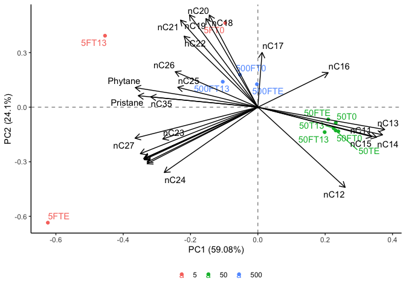

```r
library(tidyverse)
```

```
## ── Attaching packages ─────────────────────────────────────── tidyverse 1.3.2 ──
## ✔ ggplot2 3.4.0      ✔ purrr   1.0.1 
## ✔ tibble  3.1.8      ✔ dplyr   1.0.10
## ✔ tidyr   1.2.1      ✔ stringr 1.5.0 
## ✔ readr   2.1.3      ✔ forcats 0.5.2 
## ── Conflicts ────────────────────────────────────────── tidyverse_conflicts() ──
## ✖ dplyr::filter() masks stats::filter()
## ✖ dplyr::lag()    masks stats::lag()
```

```r
library(janitor)
```

```
## 
## Attaching package: 'janitor'
## 
## The following objects are masked from 'package:stats':
## 
##     chisq.test, fisher.test
```

```r
library(here)
```

```
## here() starts at /Users/blake/Library/Mobile Documents/com~apple~CloudDocs/Desktop/CEOS Technician/R/Alkane PCA
```

```r
library(gt)
library(broom) 
library(fs)
library(stats)
library(ggrepel)
library(patchwork)
library(ggfortify)
library(knitr)
```


```r
alkane_dataset <- read_csv(here("data", "tidy_alkane_pca_data.csv")) %>%
  mutate(oil_concentration = as.character(oil_concentration))
```

```
## Rows: 12 Columns: 29
## ── Column specification ────────────────────────────────────────────────────────
## Delimiter: ","
## chr  (1): sample_id
## dbl (28): oil_concentration, nC11, nC12, nC13, nC14, nC15, nC16, Pristane, n...
## 
## ℹ Use `spec()` to retrieve the full column specification for this data.
## ℹ Specify the column types or set `show_col_types = FALSE` to quiet this message.
```

```r
alkane_dataset
```

```
## # A tibble: 12 × 29
##    oil_concentr…¹ sampl…²    nC11  nC12   nC13   nC14  nC15  nC16 Prist…³   nC17
##    <chr>          <chr>     <dbl> <dbl>  <dbl>  <dbl> <dbl> <dbl>   <dbl>  <dbl>
##  1 5              5FT0     0.0280  4.96  7.49   6.05  10.2  13.3     5.05  6.41 
##  2 5              5FT13    0.164   2.73  0.240  0.875  1.19  3.99   28.2   0.973
##  3 5              5FTE     0.533  11.5   0.742  1.12   4.24  1.99   20.7   0.146
##  4 50             50T0    10.8    13.4  19.2   20.5   17.9   8.60    1.75  2.73 
##  5 50             50T13   13.0    13.9  18.9   20.5   16.9   7.55    1.52  2.51 
##  6 50             50TE    13.5    15.1  19.8   19.1   16.3   7.47    1.63  2.42 
##  7 50             50FT0   14.7    16.1  20.9   19.6   14.6   6.29    1.48  2.63 
##  8 50             50FT13  14.1    14.7  19.0   19.2   15.3   7.75    1.73  2.15 
##  9 50             50FTE   12.3    13.3  17.9   18.2   15.6   9.31    4.43  2.52 
## 10 500            500FT0  10.3     8.28 11.1    9.70   7.14  4.26    8.41 10.4  
## 11 500            500FT13  8.61    8.38 10.8   10.1    7.29  3.84    8.55 11.4  
## 12 500            500FTE  10.3     9.88 12.7   11.5    8.07  3.59    8.60 11.0  
## # … with 19 more variables: Phytane <dbl>, nC18 <dbl>, nC19 <dbl>, nC20 <dbl>,
## #   nC21 <dbl>, nC22 <dbl>, nC23 <dbl>, nC24 <dbl>, nC25 <dbl>, nC26 <dbl>,
## #   nC27 <dbl>, nC28 <dbl>, nC29 <dbl>, nC30 <dbl>, nC31 <dbl>, nC32 <dbl>,
## #   nC33 <dbl>, nC34 <dbl>, nC35 <dbl>, and abbreviated variable names
## #   ¹​oil_concentration, ²​sample_id, ³​Pristane
```


```r
alkane_pca <- alkane_dataset %>% #assigning the loaded dataset to an object
  nest() %>% #nesting the data
  mutate(pca = map(data, ~prcomp(.x %>% select(-oil_concentration, -sample_id), center = TRUE, scale = TRUE)), #performing a PCA while distinguishing results based on the sites and sample IDs
         pca_aug = map2(pca, data, ~augment(.x, data = .y))) #adding augmented data from the PCA to the dataset 
```

```
## Warning: `...` must not be empty for ungrouped data frames.
## Did you want `data = everything()`?
```

```r
alkane_pca #calling the object
```

```
## # A tibble: 1 × 3
##   data               pca      pca_aug           
##   <list>             <list>   <list>            
## 1 <tibble [12 × 29]> <prcomp> <tibble [12 × 42]>
```


```r
test_plot <- alkane_pca %>% #assigning the PCA results to an object
  mutate(pca_graph = map2(.x = pca, .y = data, 
                          ~autoplot(.x, loadings = TRUE, loadings.label = TRUE, loadings.label.repel = TRUE, loadings.colour = "black", loadings.label.colour = "black",
                                    data = .y, label = TRUE, label.label = "sample_id", label.repel = TRUE, colour = "oil_concentration", face = "bold") + #plotting the results of the PCA
                            geom_hline(aes(yintercept = 0), linetype = "dashed", alpha = 0.5) + #adding a dashed horizontal line on y=0
                            geom_vline(aes(xintercept = 0), linetype = "dashed", alpha = 0.5) + #adding a dashed vertical line on x=0
                            theme_classic() + #applying the classic tidyverse theme to the plot
                            theme(legend.title = element_blank(), #removing the legend title
                                  legend.position = "bottom"))) #changing the position of the legend
test_plot$pca_graph #calling the PCA plot
```

```
## [[1]]
```

```
## Warning: ggrepel: 7 unlabeled data points (too many overlaps). Consider
## increasing max.overlaps
```

<!-- -->

