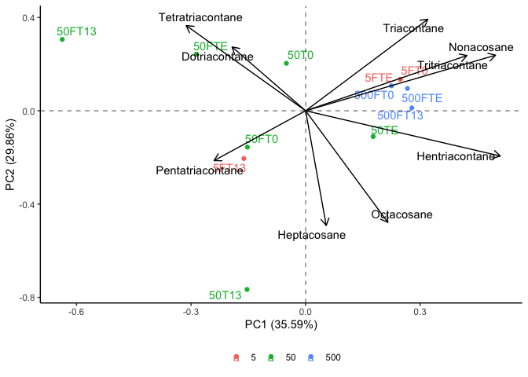

```r
library(tidyverse)
```

```
## ── Attaching packages ─────────────────────────────────────── tidyverse 1.3.2 ──
## ✔ ggplot2 3.4.0      ✔ purrr   1.0.1 
## ✔ tibble  3.1.8      ✔ dplyr   1.0.10
## ✔ tidyr   1.2.1      ✔ stringr 1.5.0 
## ✔ readr   2.1.3      ✔ forcats 0.5.2 
## ── Conflicts ────────────────────────────────────────── tidyverse_conflicts() ──
## ✖ dplyr::filter() masks stats::filter()
## ✖ dplyr::lag()    masks stats::lag()
```

```r
library(janitor)
```

```
## 
## Attaching package: 'janitor'
## 
## The following objects are masked from 'package:stats':
## 
##     chisq.test, fisher.test
```

```r
library(here)
```

```
## here() starts at /Users/blake/Library/Mobile Documents/com~apple~CloudDocs/Desktop/CEOS Technician/R/Long Chain PCA
```

```r
library(gt)
library(broom) 
library(fs)
library(stats)
library(ggrepel)
library(patchwork)
library(ggfortify)
library(knitr)
```


```r
long_chain_dataset <- read_csv(here("data", "tidy_long_chain_pca_data.csv")) %>%
  mutate(oil_concentration = as.character(oil_concentration))
```

```
## Rows: 12 Columns: 11
## ── Column specification ────────────────────────────────────────────────────────
## Delimiter: ","
## chr  (1): sample_id
## dbl (10): oil_concentration, Heptacosane, Octacosane, Nonacosane, Triacontan...
## 
## ℹ Use `spec()` to retrieve the full column specification for this data.
## ℹ Specify the column types or set `show_col_types = FALSE` to quiet this message.
```

```r
long_chain_dataset
```

```
## # A tibble: 12 × 11
##    oil_concent…¹ sampl…² Hepta…³ Octac…⁴ Nonac…⁵ Triac…⁶ Hentr…⁷ Dotri…⁸ Tritr…⁹
##    <chr>         <chr>     <dbl>   <dbl>   <dbl>   <dbl>   <dbl>   <dbl>   <dbl>
##  1 5             5FT0       7.74   10.9    11.8    11.3    11.4     9.89   10.9 
##  2 5             5FT13     10.2     9.28    7.48    7.18    7.23    6.29    6.92
##  3 5             5FTE       7.74   10.9    11.8    11.3    11.4     9.89   10.9 
##  4 50            50T0       6.01    8.50    9.14    8.77    8.83   30.0     8.45
##  5 50            50T13     22.8    19.2     1.64    4.69   10.4     8.51    4.91
##  6 50            50TE       3.00   15.9     9.47    7.43   13.3     8.16   10.2 
##  7 50            50FT0      5.14    8.48    7.81    7.51    7.56    4.59    7.23
##  8 50            50FT13     3.96    7.24    1.24    9.74    1.79   26.0     3.34
##  9 50            50FTE      4.77    6.75    7.25    6.96    2.28    6.10   11.4 
## 10 500           500FT0     8.64   11.0    10.8    12.5    11.4    11.9     9.56
## 11 500           500FT13   11.0    11.9    11.8    11.4    11.4     9.78   10.3 
## 12 500           500FTE     8.68   11.3    11.8    12.5    11.4     9.63    9.91
## # … with 2 more variables: Tetratriacontane <dbl>, Pentatriacontane <dbl>, and
## #   abbreviated variable names ¹​oil_concentration, ²​sample_id, ³​Heptacosane,
## #   ⁴​Octacosane, ⁵​Nonacosane, ⁶​Triacontane, ⁷​Hentriacontane, ⁸​Dotriacontane,
## #   ⁹​Tritriacontane
```


```r
long_chain_pca <- long_chain_dataset %>% #assigning the loaded dataset to an object
  nest() %>% #nesting the data
  mutate(pca = map(data, ~prcomp(.x %>% select(-oil_concentration, -sample_id), center = TRUE, scale = TRUE)), #performing a PCA while distinguishing results based on the sites and sample IDs
         pca_aug = map2(pca, data, ~augment(.x, data = .y))) #adding augmented data from the PCA to the dataset 
```

```
## Warning: `...` must not be empty for ungrouped data frames.
## Did you want `data = everything()`?
```

```r
long_chain_pca #calling the object
```

```
## # A tibble: 1 × 3
##   data               pca      pca_aug           
##   <list>             <list>   <list>            
## 1 <tibble [12 × 11]> <prcomp> <tibble [12 × 21]>
```


```r
test_plot <- long_chain_pca %>% #assigning the PCA results to an object
  mutate(pca_graph = map2(.x = pca, .y = data, 
                          ~autoplot(.x, loadings = TRUE, loadings.label = TRUE, loadings.label.repel = TRUE, loadings.colour = "black", loadings.label.colour = "black",
                                    data = .y, label = TRUE, label.label = "sample_id", label.repel = TRUE, colour = "oil_concentration", face = "bold") + #plotting the results of the PCA
                            geom_hline(aes(yintercept = 0), linetype = "dashed", alpha = 0.5) + #adding a dashed horizontal line on y=0
                            geom_vline(aes(xintercept = 0), linetype = "dashed", alpha = 0.5) + #adding a dashed vertical line on x=0
                            theme_classic() + #applying the classic tidyverse theme to the plot
                            theme(legend.title = element_blank(), #removing the legend title
                                  legend.position = "bottom"))) #changing the position of the legend
test_plot$pca_graph #calling the PCA plot
```

```
## [[1]]
```

<!-- -->

