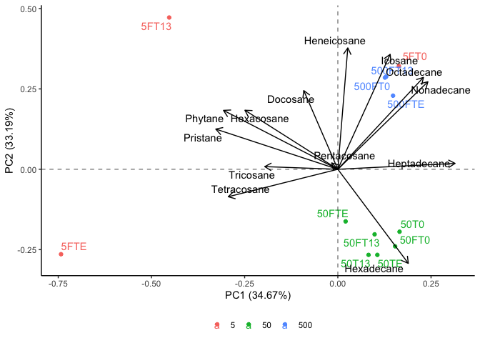

```r
library(tidyverse)
```

```
## ── Attaching packages ─────────────────────────────────────── tidyverse 1.3.2 ──
## ✔ ggplot2 3.4.0      ✔ purrr   1.0.1 
## ✔ tibble  3.1.8      ✔ dplyr   1.0.10
## ✔ tidyr   1.2.1      ✔ stringr 1.5.0 
## ✔ readr   2.1.3      ✔ forcats 0.5.2 
## ── Conflicts ────────────────────────────────────────── tidyverse_conflicts() ──
## ✖ dplyr::filter() masks stats::filter()
## ✖ dplyr::lag()    masks stats::lag()
```

```r
library(janitor)
```

```
## 
## Attaching package: 'janitor'
## 
## The following objects are masked from 'package:stats':
## 
##     chisq.test, fisher.test
```

```r
library(here)
```

```
## here() starts at /Users/blake/Library/Mobile Documents/com~apple~CloudDocs/Desktop/CEOS Technician/R/Medium Chain PCA
```

```r
library(gt)
library(broom) 
library(fs)
library(stats)
library(ggrepel)
library(patchwork)
library(ggfortify)
library(knitr)
```


```r
medium_chain_dataset <- read_csv(here("data", "tidy_medium_chain_pca_data.csv")) %>%
  mutate(oil_concentration = as.character(oil_concentration))
```

```
## Rows: 12 Columns: 15
## ── Column specification ────────────────────────────────────────────────────────
## Delimiter: ","
## chr  (1): sample_id
## dbl (14): oil_concentration, Hexadecane, Pristane, Heptadecane, Phytane, Oct...
## 
## ℹ Use `spec()` to retrieve the full column specification for this data.
## ℹ Specify the column types or set `show_col_types = FALSE` to quiet this message.
```

```r
medium_chain_dataset
```

```
## # A tibble: 12 × 15
##    oil_concent…¹ sampl…² Hexad…³ Prist…⁴ Hepta…⁵ Phytane Octad…⁶ Nonad…⁷ Icosane
##    <chr>         <chr>     <dbl>   <dbl>   <dbl>   <dbl>   <dbl>   <dbl>   <dbl>
##  1 5             5FT0      18.9     7.15   9.08     5.46   13.7     7.99    7.96
##  2 5             5FT13      4.52   31.9    1.10    14.6     6.17    4.27    6.55
##  3 5             5FTE       2.91   30.2    0.213   14.0     1.21    1.26    1.31
##  4 50            50T0      47.2     9.61  15.0      4.79    5.98    5.14    4.06
##  5 50            50T13     45.4     9.17  15.1      4.10    5.38    3.81    2.80
##  6 50            50TE      46.7    10.2   15.2      3.99    5.47    3.94    3.03
##  7 50            50FT0     44.6    10.5   18.6      4.92    5.88    4.49    3.61
##  8 50            50FT13    46.1    10.3   12.8      5.04    5.90    4.86    4.00
##  9 50            50FTE     41.4    19.7   11.2      9.19    5.64    5.06    4.48
## 10 500           500FT0     8.28   16.4   20.1      9.24   10.2     9.04    8.06
## 11 500           500FT13    7.45   16.6   22.0      8.92   10.4     8.69    6.97
## 12 500           500FTE     7.86   18.8   24.0      9.33   10.9     8.32    7.03
## # … with 6 more variables: Heneicosane <dbl>, Docosane <dbl>, Tricosane <dbl>,
## #   Tetracosane <dbl>, Pentacosane <dbl>, Hexacosane <dbl>, and abbreviated
## #   variable names ¹​oil_concentration, ²​sample_id, ³​Hexadecane, ⁴​Pristane,
## #   ⁵​Heptadecane, ⁶​Octadecane, ⁷​Nonadecane
```


```r
medium_chain_pca <- medium_chain_dataset %>% #assigning the loaded dataset to an object
  nest() %>% #nesting the data
  mutate(pca = map(data, ~prcomp(.x %>% select(-oil_concentration, -sample_id), center = TRUE, scale = TRUE)), #performing a PCA while distinguishing results based on the sites and sample IDs
         pca_aug = map2(pca, data, ~augment(.x, data = .y))) #adding augmented data from the PCA to the dataset 
```

```
## Warning: `...` must not be empty for ungrouped data frames.
## Did you want `data = everything()`?
```

```r
medium_chain_pca #calling the object
```

```
## # A tibble: 1 × 3
##   data               pca      pca_aug           
##   <list>             <list>   <list>            
## 1 <tibble [12 × 15]> <prcomp> <tibble [12 × 28]>
```


```r
test_plot <- medium_chain_pca %>% #assigning the PCA results to an object
  mutate(pca_graph = map2(.x = pca, .y = data, 
                          ~autoplot(.x, loadings = TRUE, loadings.label = TRUE, loadings.label.repel = TRUE, loadings.colour = "black", loadings.label.colour = "black",
                                    data = .y, label = TRUE, label.label = "sample_id", label.repel = TRUE, colour = "oil_concentration", face = "bold") + #plotting the results of the PCA
                            geom_hline(aes(yintercept = 0), linetype = "dashed", alpha = 0.5) + #adding a dashed horizontal line on y=0
                            geom_vline(aes(xintercept = 0), linetype = "dashed", alpha = 0.5) + #adding a dashed vertical line on x=0
                            theme_classic() + #applying the classic tidyverse theme to the plot
                            theme(legend.title = element_blank(), #removing the legend title
                                  legend.position = "bottom"))) #changing the position of the legend
test_plot$pca_graph #calling the PCA plot
```

```
## [[1]]
```

<!-- -->

