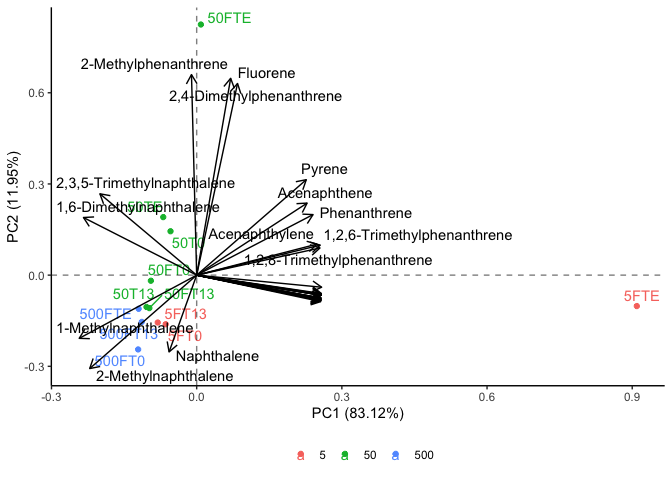

```r
library(tidyverse)
```

```
## ── Attaching packages ─────────────────────────────────────── tidyverse 1.3.2 ──
## ✔ ggplot2 3.4.0      ✔ purrr   1.0.1 
## ✔ tibble  3.1.8      ✔ dplyr   1.0.10
## ✔ tidyr   1.2.1      ✔ stringr 1.5.0 
## ✔ readr   2.1.3      ✔ forcats 0.5.2 
## ── Conflicts ────────────────────────────────────────── tidyverse_conflicts() ──
## ✖ dplyr::filter() masks stats::filter()
## ✖ dplyr::lag()    masks stats::lag()
```

```r
library(janitor)
```

```
## 
## Attaching package: 'janitor'
## 
## The following objects are masked from 'package:stats':
## 
##     chisq.test, fisher.test
```

```r
library(here)
```

```
## here() starts at /Users/blake/Library/Mobile Documents/com~apple~CloudDocs/Desktop/CEOS Technician/R/PAH PCA
```

```r
library(gt)
library(broom) 
library(fs)
library(stats)
library(ggrepel)
library(patchwork)
library(ggfortify)
library(knitr)
```


```r
pah_dataset <- read_csv(here("data", "tidy_pah_pca_data.csv")) %>%
  mutate(oil_concentration = as.character(oil_concentration))
```

```
## Rows: 12 Columns: 36
## ── Column specification ────────────────────────────────────────────────────────
## Delimiter: ","
## chr  (1): sample_id
## dbl (35): oil_concentration, Naphthalene, 2-Methylnaphthalene, 1-Methylnapht...
## 
## ℹ Use `spec()` to retrieve the full column specification for this data.
## ℹ Specify the column types or set `show_col_types = FALSE` to quiet this message.
```

```r
pah_dataset
```

```
## # A tibble: 12 × 36
##    oil_concent…¹ sampl…² Napht…³ 2-Met…⁴ 1-Met…⁵ 1,6-D…⁶ Acena…⁷ Acena…⁸ 2,3,5…⁹
##    <chr>         <chr>     <dbl>   <dbl>   <dbl>   <dbl>   <dbl>   <dbl>   <dbl>
##  1 5             5FT0      3.88    27.8    18.4    23.7    0.959   1.14    12.4 
##  2 5             5FT13     2.28    24.3    20.9    26.5    0.825   1.20    13.6 
##  3 5             5FTE      1.78     2.24    2.19    2.22   2.91    2.25     2.68
##  4 50            50T0      4.85    27.9    19.0    19.2    0.968   0.977    8.91
##  5 50            50T13     4.77    29.7    19.6    22.6    0.998   1.10    11.3 
##  6 50            50TE      0.736   26.5    16.8    27.3    0.953   1.16    11.2 
##  7 50            50FT0     4.88    28.1    18.7    22.9    1.10    1.14    11.5 
##  8 50            50FT13    2.56    30.8    21.4    23.3    1.04    1.04     9.74
##  9 50            50FTE     0.954   10.9    12.6    28.9    1.59    1.78    16.3 
## 10 500           500FT0    5.82    29.8    20.5    24.0    1.06    1.07    10.9 
## 11 500           500FT13   2.41    31.4    20.8    23.2    1.11    1.17    12.2 
## 12 500           500FTE    0.119   31.4    20.1    26.0    1.07    1.16    12.8 
## # … with 27 more variables: Fluorene <dbl>, Dibenzothiophene <dbl>,
## #   Phenanthrene <dbl>, Anthracene <dbl>, `2-Methyldibenzothiophene` <dbl>,
## #   `2-Methylphenanthrene` <dbl>, `2,8-Dimethyldibenzothiophene` <dbl>,
## #   `2,4-Dimethylphenanthrene` <dbl>, Pyrene <dbl>,
## #   `1,2,6-Trimethylphenanthrene` <dbl>, `1,2,8-Trimethylphenanthrene` <dbl>,
## #   `1-Methylfluoranthene` <dbl>, `Benzo[e]phenanthrene` <dbl>,
## #   `Benz[a]anthracene` <dbl>, Triphenylene <dbl>, Chrysene <dbl>, …
```


```r
pah_pca <- pah_dataset %>% #assigning the loaded dataset to an object
  nest() %>% #nesting the data
  mutate(pca = map(data, ~prcomp(.x %>% select(-oil_concentration, -sample_id), center = TRUE, scale = TRUE)), #performing a PCA while distinguishing results based on the sites and sample IDs
         pca_aug = map2(pca, data, ~augment(.x, data = .y))) #adding augmented data from the PCA to the dataset 
```

```
## Warning: `...` must not be empty for ungrouped data frames.
## Did you want `data = everything()`?
```

```r
pah_pca #calling the object
```

```
## # A tibble: 1 × 3
##   data               pca      pca_aug           
##   <list>             <list>   <list>            
## 1 <tibble [12 × 36]> <prcomp> <tibble [12 × 49]>
```


```r
test_plot <- pah_pca %>% #assigning the PCA results to an object
  mutate(pca_graph = map2(.x = pca, .y = data, 
                          ~autoplot(.x, loadings = TRUE, loadings.label = TRUE, loadings.label.repel = TRUE, loadings.colour = "black", loadings.label.colour = "black",
                                    data = .y, label = TRUE, label.label = "sample_id", label.repel = TRUE, colour = "oil_concentration", face = "bold") + #plotting the results of the PCA
                            geom_hline(aes(yintercept = 0), linetype = "dashed", alpha = 0.5) + #adding a dashed horizontal line on y=0
                            geom_vline(aes(xintercept = 0), linetype = "dashed", alpha = 0.5) + #adding a dashed vertical line on x=0
                            theme_classic() + #applying the classic tidyverse theme to the plot
                            theme(legend.title = element_blank(), #removing the legend title
                                  legend.position = "bottom"))) #changing the position of the legend
test_plot$pca_graph #calling the PCA plot
```

```
## [[1]]
```

```
## Warning: ggrepel: 20 unlabeled data points (too many overlaps). Consider
## increasing max.overlaps
```

<!-- -->

