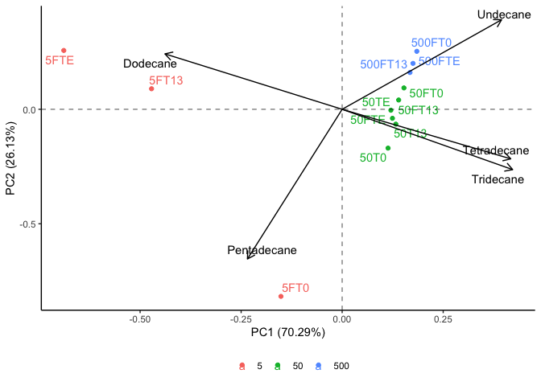

```r
library(tidyverse)
```

```
## ── Attaching packages ─────────────────────────────────────── tidyverse 1.3.2 ──
## ✔ ggplot2 3.4.0      ✔ purrr   1.0.1 
## ✔ tibble  3.1.8      ✔ dplyr   1.0.10
## ✔ tidyr   1.2.1      ✔ stringr 1.5.0 
## ✔ readr   2.1.3      ✔ forcats 0.5.2 
## ── Conflicts ────────────────────────────────────────── tidyverse_conflicts() ──
## ✖ dplyr::filter() masks stats::filter()
## ✖ dplyr::lag()    masks stats::lag()
```

```r
library(janitor)
```

```
## 
## Attaching package: 'janitor'
## 
## The following objects are masked from 'package:stats':
## 
##     chisq.test, fisher.test
```

```r
library(here)
```

```
## here() starts at /Users/blake/Library/Mobile Documents/com~apple~CloudDocs/Desktop/CEOS Technician/R/Short Chain PCA
```

```r
library(gt)
library(broom) 
library(fs)
library(stats)
library(ggrepel)
library(patchwork)
library(ggfortify)
library(knitr)
```


```r
short_chain_dataset <- read_csv(here("data", "tidy_short_chain_pca_data.csv")) %>%
  mutate(oil_concentration = as.character(oil_concentration))
```

```
## Rows: 12 Columns: 7
## ── Column specification ────────────────────────────────────────────────────────
## Delimiter: ","
## chr (1): sample_id
## dbl (6): oil_concentration, Undecane, Dodecane, Tridecane, Tetradecane, Pent...
## 
## ℹ Use `spec()` to retrieve the full column specification for this data.
## ℹ Specify the column types or set `show_col_types = FALSE` to quiet this message.
```

```r
short_chain_dataset
```

```
## # A tibble: 12 × 7
##    oil_concentration sample_id Undecane Dodecane Tridecane Tetradecane Pentade…¹
##    <chr>             <chr>        <dbl>    <dbl>     <dbl>       <dbl>     <dbl>
##  1 5                 5FT0        0.0974     17.3     26.1        21.1       35.5
##  2 5                 5FT13       3.14       52.5      4.62       16.8       22.9
##  3 5                 5FTE        2.93       63.5      4.08        6.18      23.3
##  4 50                50T0       13.2        16.4     23.4        25.1       21.9
##  5 50                50T13      15.6        16.7     22.7        24.6       20.4
##  6 50                50TE       16.2        18.0     23.6        22.8       19.5
##  7 50                50FT0      17.2        18.7     24.3        22.8       17.0
##  8 50                50FT13     17.1        17.9     23.1        23.3       18.6
##  9 50                50FTE      15.9        17.2     23.1        23.6       20.1
## 10 500               500FT0     22.2        17.8     23.8        20.8       15.3
## 11 500               500FT13    19.1        18.6     23.9        22.4       16.1
## 12 500               500FTE     19.7        18.8     24.2        22.0       15.4
## # … with abbreviated variable name ¹​Pentadecane
```


```r
short_chain_pca <- short_chain_dataset %>% #assigning the loaded dataset to an object
  nest() %>% #nesting the data
  mutate(pca = map(data, ~prcomp(.x %>% select(-oil_concentration, -sample_id), center = TRUE, scale = TRUE)), #performing a PCA while distinguishing results based on the sites and sample IDs
         pca_aug = map2(pca, data, ~augment(.x, data = .y))) #adding augmented data from the PCA to the dataset 
```

```
## Warning: `...` must not be empty for ungrouped data frames.
## Did you want `data = everything()`?
```

```r
short_chain_pca #calling the object
```

```
## # A tibble: 1 × 3
##   data              pca      pca_aug           
##   <list>            <list>   <list>            
## 1 <tibble [12 × 7]> <prcomp> <tibble [12 × 13]>
```


```r
test_plot <- short_chain_pca %>% #assigning the PCA results to an object
  mutate(pca_graph = map2(.x = pca, .y = data, 
                          ~autoplot(.x, loadings = TRUE, loadings.label = TRUE, loadings.label.repel = TRUE, loadings.colour = "black", loadings.label.colour = "black",
                                    data = .y, label = TRUE, label.label = "sample_id", label.repel = TRUE, colour = "oil_concentration", face = "bold") + #plotting the results of the PCA
                            geom_hline(aes(yintercept = 0), linetype = "dashed", alpha = 0.5) + #adding a dashed horizontal line on y=0
                            geom_vline(aes(xintercept = 0), linetype = "dashed", alpha = 0.5) + #adding a dashed vertical line on x=0
                            theme_classic() + #applying the classic tidyverse theme to the plot
                            theme(legend.title = element_blank(), #removing the legend title
                                  legend.position = "bottom"))) #changing the position of the legend
test_plot$pca_graph #calling the PCA plot
```

```
## [[1]]
```

<!-- -->

