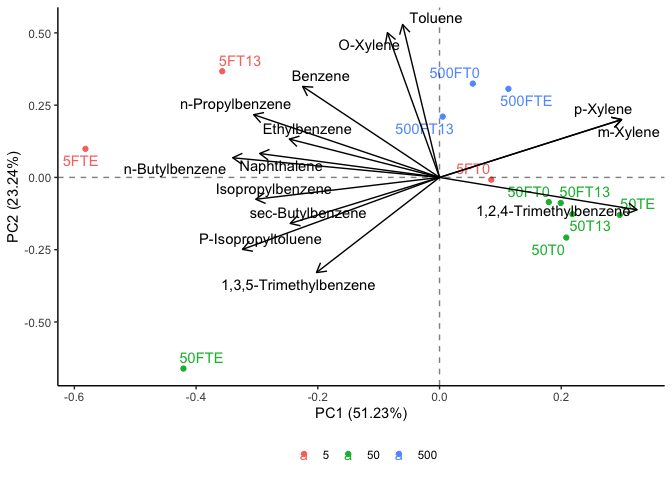

```r
library(tidyverse)
```

```
## ── Attaching packages ─────────────────────────────────────── tidyverse 1.3.2 ──
## ✔ ggplot2 3.4.0      ✔ purrr   1.0.1 
## ✔ tibble  3.1.8      ✔ dplyr   1.0.10
## ✔ tidyr   1.2.1      ✔ stringr 1.5.0 
## ✔ readr   2.1.3      ✔ forcats 0.5.2 
## ── Conflicts ────────────────────────────────────────── tidyverse_conflicts() ──
## ✖ dplyr::filter() masks stats::filter()
## ✖ dplyr::lag()    masks stats::lag()
```

```r
library(janitor)
```

```
## 
## Attaching package: 'janitor'
## 
## The following objects are masked from 'package:stats':
## 
##     chisq.test, fisher.test
```

```r
library(here)
```

```
## here() starts at /Users/blake/Library/Mobile Documents/com~apple~CloudDocs/Desktop/CEOS Technician/R/VOC PCA
```

```r
library(gt)
library(broom) 
library(fs)
library(stats)
library(ggrepel)
library(patchwork)
library(ggfortify)
library(knitr)
```


```r
voc_dataset <- read_csv(here("data", "tidy_voc_pca_data.csv")) %>%
  mutate(oil_concentration = as.character(oil_concentration))
```

```
## Rows: 12 Columns: 16
## ── Column specification ────────────────────────────────────────────────────────
## Delimiter: ","
## chr  (1): sample_id
## dbl (15): oil_concentration, Benzene, Ethylbenzene, Toluene, m-Xylene, p-Xyl...
## 
## ℹ Use `spec()` to retrieve the full column specification for this data.
## ℹ Specify the column types or set `show_col_types = FALSE` to quiet this message.
```

```r
voc_dataset
```

```
## # A tibble: 12 × 16
##    oil_concent…¹ sampl…² Benzene Ethyl…³ Toluene m-Xyl…⁴ p-Xyl…⁵ Isopr…⁶ O-Xyl…⁷
##    <chr>         <chr>     <dbl>   <dbl>   <dbl>   <dbl>   <dbl>   <dbl>   <dbl>
##  1 5             5FT0      0.863    3.17    8.59   6.07    6.07    1.08    7.90 
##  2 5             5FT13     1.54     6.97   16.5    1.37    1.37    1.70   20.8  
##  3 5             5FTE      4.11     5.80    9.02   3.65    3.65   14.9    10.0  
##  4 50            50T0      0.449    2.59    4.44   8.70    8.68    0.815   5.15 
##  5 50            50T13     0.673    2.93    5.61   9.15    9.15    0.808   6.20 
##  6 50            50TE      0.686    2.90    6.78   9.79    9.77    1.33    7.01 
##  7 50            50FT0     0.647    3.67    5.76   9.86    9.82    1.02    6.85 
##  8 50            50FT13    0.692    3.56    6.47   9.80    9.80    0.900   7.19 
##  9 50            50FTE     0.500    8.31    1.10   0.282   0.282   6.62    0.764
## 10 500           500FT0    2.09     7.20   13.1   11.7    11.7     1.24   12.2  
## 11 500           500FT13   1.73     6.33   11.2   11.1    11.1     1.31   11.8  
## 12 500           500FTE    2.02     7.31   12.4   12.4    12.4     1.39   12.3  
## # … with 7 more variables: `n-Propylbenzene` <dbl>,
## #   `1,3,5-Trimethylbenzene` <dbl>, `1,2,4-Trimethylbenzene` <dbl>,
## #   `sec-Butylbenzene` <dbl>, `P-Isopropyltoluene` <dbl>,
## #   `n-Butylbenzene` <dbl>, Naphthalene <dbl>, and abbreviated variable names
## #   ¹​oil_concentration, ²​sample_id, ³​Ethylbenzene, ⁴​`m-Xylene`, ⁵​`p-Xylene`,
## #   ⁶​Isopropylbenzene, ⁷​`O-Xylene`
```


```r
voc_pca <- voc_dataset %>% #assigning the loaded dataset to an object
  nest() %>% #nesting the data
  mutate(pca = map(data, ~prcomp(.x %>% select(-oil_concentration, -sample_id), center = TRUE, scale = TRUE)), #performing a PCA while distinguishing results based on the sites and sample IDs
         pca_aug = map2(pca, data, ~augment(.x, data = .y))) #adding augmented data from the PCA to the dataset 
```

```
## Warning: `...` must not be empty for ungrouped data frames.
## Did you want `data = everything()`?
```

```r
voc_pca #calling the object
```

```
## # A tibble: 1 × 3
##   data               pca      pca_aug           
##   <list>             <list>   <list>            
## 1 <tibble [12 × 16]> <prcomp> <tibble [12 × 29]>
```


```r
test_plot <- voc_pca %>% #assigning the PCA results to an object
  mutate(pca_graph = map2(.x = pca, .y = data, 
                          ~autoplot(.x, loadings = TRUE, loadings.label = TRUE, loadings.label.repel = TRUE, loadings.colour = "black", loadings.label.colour = "black",
                                    data = .y, label = TRUE, label.label = "sample_id", label.repel = TRUE, colour = "oil_concentration", face = "bold") + #plotting the results of the PCA
                            geom_hline(aes(yintercept = 0), linetype = "dashed", alpha = 0.5) + #adding a dashed horizontal line on y=0
                            geom_vline(aes(xintercept = 0), linetype = "dashed", alpha = 0.5) + #adding a dashed vertical line on x=0
                            theme_classic() + #applying the classic tidyverse theme to the plot
                            theme(legend.title = element_blank(), #removing the legend title
                                  legend.position = "bottom"))) #changing the position of the legend
test_plot$pca_graph #calling the PCA plot
```

```
## [[1]]
```

<!-- -->
